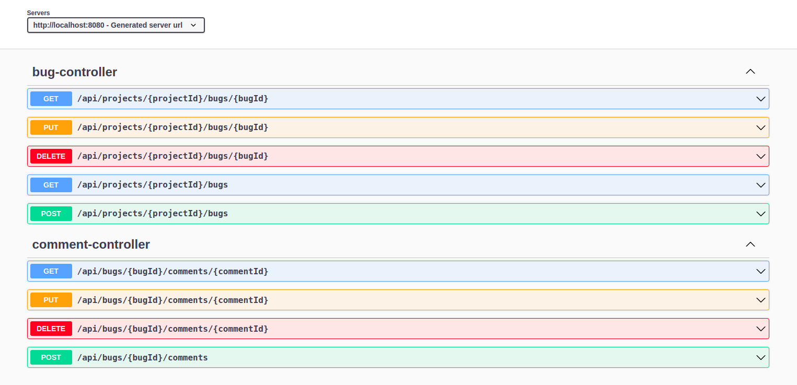

# Bug-Tracker-API
This is a RESTful api developed using Spring Boot framework to implement a simple bug tracker API. 
The API runs on port 8080 by default and requires Java 17 or above

## Key Assumptions
* Main entities of this project are `Project`, `Bug` and `Comment` 
* Projects are pre-populated and the API does not allow endpoints to modify the `Projects`
* Database is pre-populated with the following data

#### `Project`
| id  | name          | project_key |
|-----|---------------|-------------|
| 1   | Project 1     | project-1   |

#### `Bug`
| id  | description   | name  | reported_by | status | severity | project_id |
|-----|---------------|-------|-------------|--------|----------|------------|
| 1   | Description 1 | Bug 1 | USER 1      | OPEN   | LOW      | 1          |
| 2   | Description 2 | Bug 2 | USER 2      | CLOSED | MEDIUM   | 1          |

#### `Comment`
| id  | author | content   | issue_id |
|-----|--------|-----------|----------|
| 1   | USER 1 | Comment 1 | 1        |
| 2   | USER 2 | Comment 2 | 1        |
| 3   | USER 1 | Comment 1 | 2        |
| 4   | USER 2 | Comment 2 | 2        |

## API Spec
#### Swagger UI
[http://localhost:8080/swagger-ui/index.html](http://localhost:8080/swagger-ui/index.html)



#### Success Response
```
{
    "success": true,
    "data": {
        "id": 1,
        "name": "Bug 1",
        "description": "Description 1",
        "project": {
            "id": 1,
            "projectKey": "project-1",
            "name": "Project 1"
        },
        "comments": [
            {
                "id": 1,
                "issueId": 1,
                "author": "USER 1",
                "content": "Comment 1"
            }
        ],
        "status": "OPEN",
        "reportedBy": "USER 1",
        "severity": "LOW"
    },
    "errorResponse": null
}
```
#### Error Response
```
{
    "success": false,
    "data": null,
    "errorResponse": {
        "code": "400",
        "message": "Requested resource not found",
        "additionalInfo": "Requested bug was not found for bug id [1]"
    }
}
```

#### Postman Collection
* [Full API Spec](Bug Tracker.postman_collection.json)


## Test
```
./gradlew clean test
```

## Build
```
./gradlew clean build
```

## Run
1. Run `./gradlew clean build` to build the jar file of the API.
2. Jar will be placed in `build/libs/bug-tracker-api-0.0.1-SNAPSHOT.jar`.
3. Run the API using `java -jar build/libs/bug-tracker-api-0.0.1-SNAPSHOT.jar`
